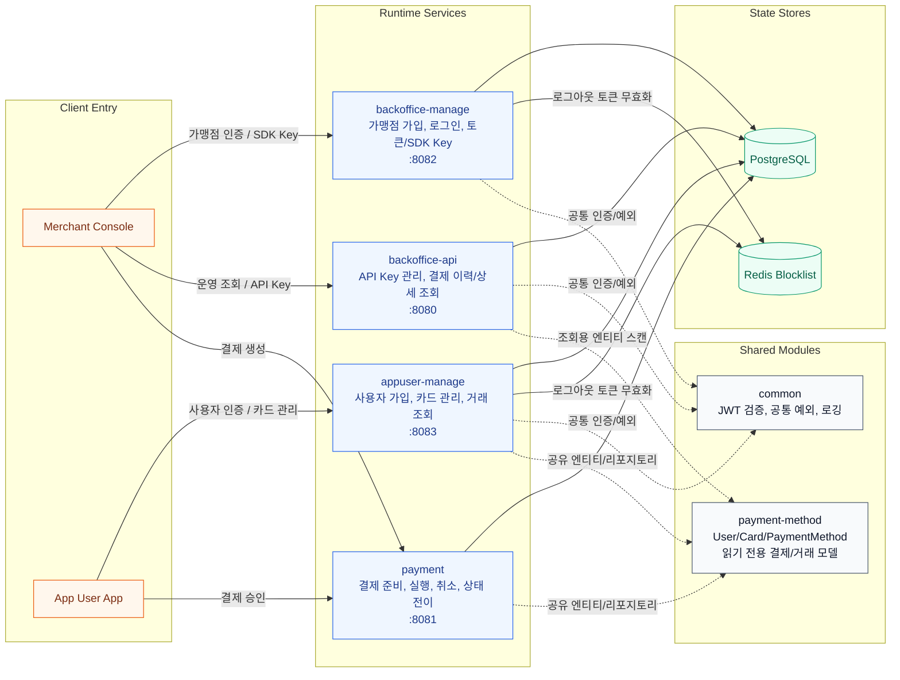
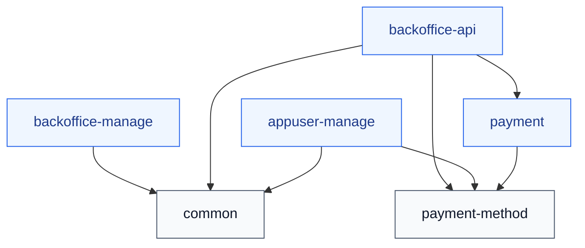
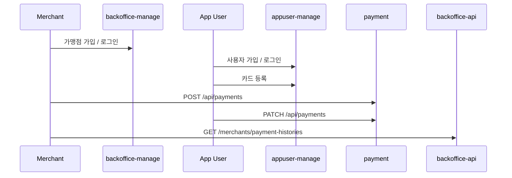

# fintech-BE

> PassionPay 결제 플랫폼 백엔드 프로젝트 저장소.  
> Java 21, Spring Boot 3.4, Gradle 멀티모듈 기반으로 가맹점, 결제, 앱 사용자 도메인을 분리한 백엔드 프로젝트입니다.

[](https://openjdk.org/)
[](https://spring.io/projects/spring-boot)
[](https://gradle.org/)
[](https://www.postgresql.org/)
[](https://redis.io/)
[](https://www.docker.com/)

## 프로젝트 개요

이 저장소는 가맹점, 결제, 앱 사용자 도메인을 분리해 운영하는 멀티모듈 모노레포입니다.

- 런타임 서비스 4개: `backoffice-api`, `backoffice-manage`, `payment`, `appuser-manage`
- 공유 모듈 2개: `payment-method`, `common`
- 핵심 주제: 도메인 분리, JWT 인증, Redis 기반 토큰 무효화, 결제 라이프사이클, 모듈별 Docker/Kubernetes 배포
- 문서 및 운영 자산: 루트 README, ADR 4건, GitHub Issue Form, Jenkinsfile, Dockerfile, Kubernetes 매니페스트

## 아키텍처

이 저장소는 런타임 서비스 분리와 공유 모듈 재사용을 함께 가져가는 구조입니다.
가맹점 인증, 앱 사용자 인증, 결제 처리, 운영 조회를 서비스 단위로 나누고,
공통 인증/예외 처리와 결제수단 도메인은 Gradle 멀티모듈로 재사용합니다.

### 런타임 뷰



- `backoffice-manage`와 `appuser-manage`는 JWT 인증과 Redis Blocklist를 사용합니다.
- `payment`는 결제 상태 전이를 담당하고, `payment-method`의 카드/결제수단 모델을 참조합니다.
- `backoffice-api`는 운영 조회 서비스이며, `payment`와 `payment-method` 패키지를 함께 스캔해 조회 모델을 가져옵니다.
- 모든 런타임 서비스는 PostgreSQL을 기준 데이터 저장소로 사용합니다.

### 모듈 구성 뷰



- `common`과 `payment-method`는 별도 포트를 열지 않는 공유 모듈입니다.
- `appuser-manage`, `payment`, `backoffice-api`는 `EntityScan`과 `EnableJpaRepositories`로 공유 엔티티/리포지토리를 가져옵니다.
- 따라서 현재 구조는 완전히 독립된 데이터 저장소를 가진 분산 시스템이라기보다, 서비스 경계를 분리한 멀티모듈 모노레포에 가깝습니다.

## 결제 흐름



## 서비스별 담당 영역

| 모듈 | 포트 | 담당 영역 | 대표 엔드포인트 |
| --- | --- | --- | --- |
| `backoffice-manage` | `8082` | 가맹점 회원가입, 로그인, 토큰 재발급, SDK Key 조회/활성화/재발급 | `/merchants/*`, `/sdk-key/*` |
| `backoffice-api` | `8080` | 관리자/백오피스용 API Key 관리, 결제 이력 조회 | `/merchants/api-keys/*`, `/merchants/payment-histories/*` |
| `payment` | `8081` | 결제 준비, 진행 조회, 실행, 취소, 결제 상태 전이 | `/api/payments/*` |
| `appuser-manage` | `8083` | 앱 사용자 가입/로그인, 카드 등록, 내 정보 조회, 거래 이력 조회 | `/app-users/*`, `/app-users/cards/*`, `/api/info/*` |
| `payment-method` | - | 사용자, 카드, 결제, 거래 조회용 공유 엔티티/리포지토리 | 없음 (`공유 도메인 모듈`) |
| `common` | - | JWT 검증, 공통 예외, 로깅 필터, 유틸리티 | 없음 (`공통 지원 모듈`) |

## 모듈 의존 구조

| 모듈 | 직접 의존 |
| --- | --- |
| `backoffice-manage` | `common` |
| `appuser-manage` | `common`, `payment-method` |
| `payment` | `payment-method` |
| `backoffice-api` | `common`, `payment`, `payment-method` |
| `payment-method` | 없음 |
| `common` | 없음 |

## 기술 스택

- Language: Java 21
- Framework: Spring Boot 3.4.5, Spring Security, Spring Data JPA, Validation, AOP
- Docs: SpringDoc OpenAPI
- Infra: PostgreSQL, Redis, Docker, Kubernetes, Jenkins
- Build: Gradle multi-module

## Quick Start

### 1. 필수 환경

- Java 21
- PostgreSQL 14+
- Redis 7+
- Docker 선택 사항

### 2. PostgreSQL 준비

```sql
CREATE DATABASE testdb;
CREATE USER testuser WITH PASSWORD 'testpass';
GRANT ALL PRIVILEGES ON DATABASE testdb TO testuser;
```

### 3. Redis 준비

```bash
docker run -d --name fintech-redis -p 6379:6379 redis:7-alpine
```

Redis 인증이 필요한 환경에서는 서비스 실행 시 `REDIS_PASSWORD` 환경변수를 주입해 동일한 값으로 맞춥니다.

### 4. 전체 빌드

```bash
./gradlew clean build
```

### 5. 서비스 실행

```bash
./gradlew :backoffice-manage:bootRun
./gradlew :appuser-manage:bootRun
./gradlew :payment:bootRun
./gradlew :backoffice-api:bootRun
```

### 6. 문서 경로 확인

```bash
curl http://localhost:8082/api-docs
curl http://localhost:8083/api-docs
curl http://localhost:8081/v3/api-docs
curl http://localhost:8080/api-docs
```

## API 요약

### Swagger / OpenAPI

| 서비스 | Swagger UI | API Docs |
| --- | --- | --- |
| `backoffice-manage` | `http://localhost:8082/swagger-ui.html` | `http://localhost:8082/api-docs` |
| `backoffice-api` | `http://localhost:8080/swagger-ui.html` | `http://localhost:8080/api-docs` |
| `payment` | `http://localhost:8081/swagger-ui.html` | `http://localhost:8081/v3/api-docs` |
| `appuser-manage` | `http://localhost:8083/swagger-ui.html` | `http://localhost:8083/api-docs` |

### 핵심 엔드포인트

| 서비스 | Method | Path | 설명 |
| --- | --- | --- | --- |
| `backoffice-manage` | `POST` | `/merchants/register` | 가맹점 회원가입 |
| `backoffice-manage` | `POST` | `/merchants/login` | 가맹점 로그인 |
| `backoffice-manage` | `GET` | `/sdk-key` | SDK Key 조회 |
| `backoffice-api` | `POST` | `/merchants/api-keys/{merchantId}` | API Key 발급 (`MERCHANT_ACCESS_TOKEN`) |
| `backoffice-api` | `GET` | `/merchants/payment-histories` | 가맹점 결제 이력 조회 (`MERCHANT_ACCESS_TOKEN`) |
| `payment` | `POST` | `/api/payments` | 결제 준비 (`MERCHANT_API_KEY`) |
| `payment` | `GET` | `/api/payments/{paymentToken}` | 결제 진행 상태 조회 |
| `payment` | `PATCH` | `/api/payments` | 결제 실행 (`USER_ACCESS_TOKEN`) |
| `payment` | `DELETE` | `/api/payments/{paymentToken}` | 결제 취소 (`MERCHANT_API_KEY`) |
| `appuser-manage` | `POST` | `/app-users/register` | 사용자 회원가입 |
| `appuser-manage` | `POST` | `/app-users/login` | 사용자 로그인 |
| `appuser-manage` | `POST` | `/app-users/cards/register` | 카드 등록 |
| `appuser-manage` | `GET` | `/api/info/transactions` | 내 거래 이력 조회 |

### 대표 요청 예시

가맹점 회원가입:

```bash
curl -X POST http://localhost:8082/merchants/register \
  -H "Content-Type: application/json" \
  -d '{
    "loginId": "merchant01",
    "loginPw": "passw0rd!",
    "name": "Sample Store",
    "businessNumber": "123-45-67890",
    "contactName": "Kim Owner",
    "contactEmail": "owner@example.com",
    "contactPhone": "010-1234-5678"
  }'
```

사용자 회원가입:

```bash
curl -X POST http://localhost:8083/app-users/register \
  -H "Content-Type: application/json" \
  -d '{
    "email": "user@example.com",
    "password": "passw0rd!",
    "name": "Hong Gil Dong",
    "phone": "010-1111-2222"
  }'
```

카드 등록:

```bash
curl -X POST http://localhost:8083/app-users/cards/register \
  -H "Authorization: Bearer {USER_ACCESS_TOKEN}" \
  -H "Content-Type: application/json" \
  -d '{
    "cardNumber": "1234-5678-9012-3456",
    "expiryDate": "12/29",
    "birthDate": "900101",
    "cardPw": "12",
    "cvc": "123",
    "paymentPassword": "123456",
    "cardCompany": "SAMPLE-CARD",
    "type": "CREDIT"
  }'
```

결제 준비:

```bash
curl -X POST http://localhost:8081/api/payments \
  -H "Authorization: Bearer {MERCHANT_API_KEY}" \
  -H "Content-Type: application/json" \
  -d '{
    "merchantId": 1,
    "amount": 15000,
    "merchantOrderId": "ORDER-001"
  }'
```

결제 실행:

```bash
curl -X PATCH http://localhost:8081/api/payments \
  -H "Authorization: Bearer {USER_ACCESS_TOKEN}" \
  -H "Content-Type: application/json" \
  -d '{
    "paymentToken": "{PAYMENT_TOKEN}",
    "cardToken": "{CARD_TOKEN}",
    "paymentMethodType": "CARD"
  }'
```

결제 이력 조회:

```bash
curl -X GET "http://localhost:8080/merchants/payment-histories?merchantId=1&startDate=2026-01-01&endDate=2026-12-31&page=0&size=20" \
  -H "Authorization: Bearer {MERCHANT_ACCESS_TOKEN}"
```

## ADR

아키텍처 의사결정 기록은 [docs/adr/README.md](./docs/adr/README.md)에 정리했습니다.

| ID | 제목 | 상태 | 관련 이슈 |
| --- | --- | --- | --- |
| `ADR-001` | [MSA 서비스 분리 기준](./docs/adr/ADR-001-msa-service-boundary.md) | Accepted | [#1](https://github.com/Acacian/fintech-BE/issues/1) |
| `ADR-002` | [공통 기능과 결제수단 도메인의 공유 모듈화](./docs/adr/ADR-002-shared-modules.md) | Accepted | [#2](https://github.com/Acacian/fintech-BE/issues/2) |
| `ADR-003` | [JWT + Redis Blocklist 인증 전략](./docs/adr/ADR-003-jwt-redis-blocklist.md) | Accepted | [#3](https://github.com/Acacian/fintech-BE/issues/3) |
| `ADR-004` | [모듈별 Docker 이미지와 Jenkins/Kubernetes 배포](./docs/adr/ADR-004-module-image-delivery.md) | Accepted | [#4](https://github.com/Acacian/fintech-BE/issues/4) |

## 변경 관리

설계 변경은 ADR로, 기능 요청과 결함 관리는 GitHub Issue Form으로 관리합니다.

- [열린 버그 이슈 보기](https://github.com/Acacian/fintech-BE/issues?q=is%3Aissue+is%3Aopen+label%3Abug)
- [열린 기능 제안 보기](https://github.com/Acacian/fintech-BE/issues?q=is%3Aissue+is%3Aopen+label%3Aenhancement)
- [열린 ADR 제안 이슈 보기](https://github.com/Acacian/fintech-BE/issues?q=is%3Aissue+is%3Aopen+label%3Aadr)
- [종료된 ADR 이슈 보기](https://github.com/Acacian/fintech-BE/issues?q=is%3Aissue+is%3Aclosed+label%3Aadr)
- [버그 리포트 등록](https://github.com/Acacian/fintech-BE/issues/new?template=bug_report.yml): 장애 재현 정보와 영향 범위를 구조화해 기록
- [기능 제안 등록](https://github.com/Acacian/fintech-BE/issues/new?template=feature_request.yml): 요구사항, 기대 효과, 우선순위를 명확히 정리
- [ADR 제안 등록](https://github.com/Acacian/fintech-BE/issues/new?template=adr_proposal.yml): 아키텍처 변경 배경과 대안, 결정 초안을 문서화
- ADR 문서는 [docs/adr/README.md](./docs/adr/README.md)에서 추적
- ADR이 Accepted로 확정되면 연결된 ADR 제안 이슈를 종료합니다.

## 배포/운영 자산

- [Jenkinsfile](./Jenkinsfile)
- [Dockerfile](./Dockerfile)
- [k8s](./k8s)

## 참고

- 상세 아키텍처 기록: [docs/adr/README.md](./docs/adr/README.md)
- 이슈 템플릿: [.github/ISSUE_TEMPLATE](./.github/ISSUE_TEMPLATE)
